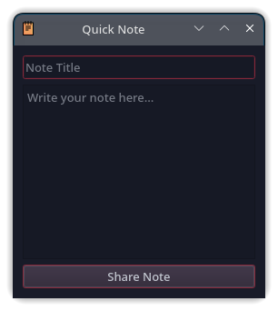
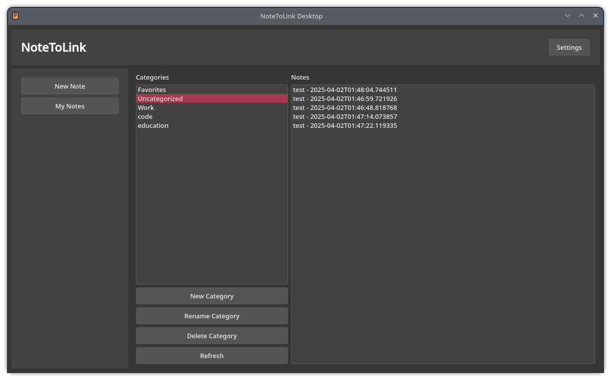

# 🚀 NoteToLink Desktop App"

**NoteToLink Desktop** is a blazing-fast, cross-platform desktop application built with **PyQt5**, designed to make note-sharing effortless and powerful. Instantly create and share notes containing text and up to 5 images via the [Notetolink API](https://notetolink.win). Organize your notes, customize the look, and stay productive with new smart features!


---

## 🌟 What's New in?

🔥 **Quick Note** → Create a note instantly from the system tray without opening the full app.



⭐ **Favorites System** → Mark important notes as favorites and access them with one click.

✏️ **Edit Existing Notes** → Update note content, images, and auto-generate a new shareable link while keeping categories & favorites intact.

🔗 **Copyable Public Links** → Directly copy your note's public URL from the note detail page.

📂 **Drag & Drop Category Assignment** → Easily assign notes to categories via drag-and-drop.

⚡ **Revamped Modern UI** → Fully redesigned, clean, and beautiful interface with Dark/Light theme support.

🗂️ **Smart Notes Panel** → View, edit, favorite or delete notes from the new & modern **My Notes** section.



---

## 🚀 Core Features

- ✍️ Create notes with title, content, and up to 5 images
- 🌐 Generate public links using the Notetolink API
- 🗂️ Organize notes into categories (with drag-and-drop support)
- ⭐ Favorite important notes
- ✏️ Edit existing notes and auto-generate new shareable link
- 🚀 Quick Note creation from system tray
- 🌙 Dark/Light theme toggle for better readability
- 🔗 Directly copy note public links
- 💾 Local JSON storage for offline use

---

## 📦 Requirements

- Python 3.8 or higher
- PyQt5
- requests

### 📥 Installation

```bash
pip install -r requirements.txt
```

**requirements.txt**
```
PyQt5>=5.15
requests
```

---

## ▶️ Running the App

```bash
python app.py
```

---

## 🗃️ Project Structure

```
notetolink-app/
├── app.py                  # Main application entry point
├── screenshot.png          # Home screen screenshot
├── quicknote.png           # Quick Note feature screenshot
├── notes.png               # My Notes panel screenshot
├── requirements.txt
├── README.md
├── icon.ico
├── LICENSE
```

---

## 🤝 Contributing

We welcome clean and useful contributions!  
Open an issue for bugs, feature requests, or send a pull request to improve the app.

---

## 📢 Contact

- 📧 Email: [toxi360@workmail.com](mailto:toxi360@workmail.com)
- 💻 GitHub: [Efeckc17](https://github.com/Efeckc17)
- 🌍 Website: [toxi360.org](https://toxi360.org)

---

## 📄 License

This project is licensed under the MIT License.

