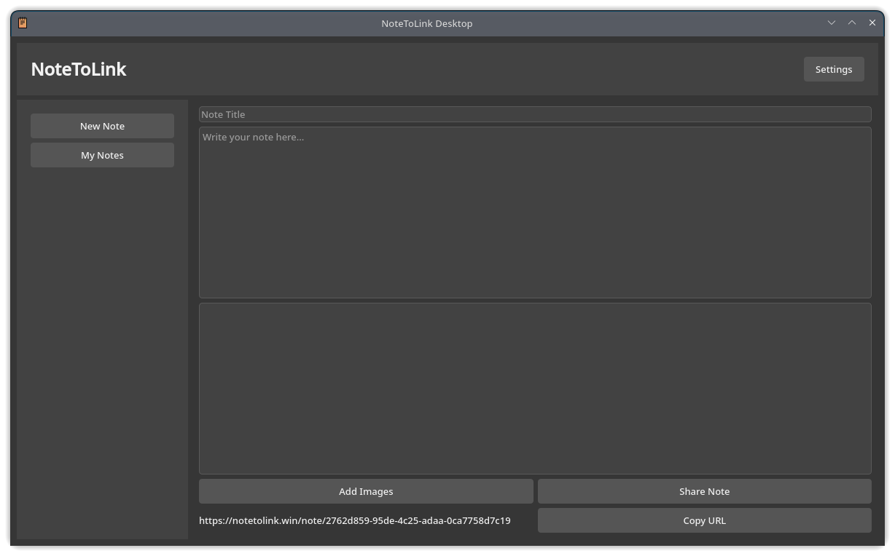
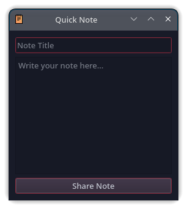
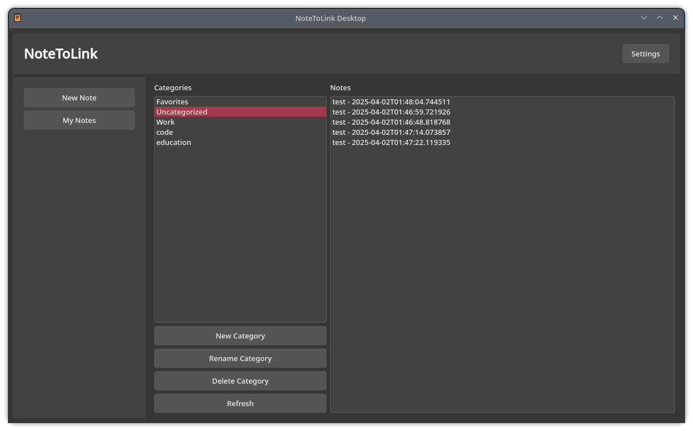

# 🚀 NoteToLink Desktop App

**NoteToLink Desktop** is a fast, modular, and cross-platform desktop application built with **PyQt5**, designed for effortless note sharing. Instantly create and share notes with text and up to 5 images via the [Notetolink API](https://notetolink.win). Organize your notes, switch themes, and boost productivity with its polished UI and smart features.



---

## 🌟 What's New?

🔥 **Quick Note** → Instantly create a note from the system tray without opening the full app.



⭐ **Favorites System** → Mark and access your most important notes with one click.

✏️ **Edit Notes** → Update note content, images, and generate a new shareable link while keeping all metadata.

🔗 **Copy Public Links** → Copy your note's public URL from the detail view.

📂 **Drag & Drop Categories** → Assign notes to categories with a smooth drag-and-drop experience.

⚡ **Refined UI** → Sleek, modern interface with full Dark/Light mode support.

🗂️ **Smart Note Panel** → Easily view, edit, favorite, or delete your notes in the improved **My Notes** section.



---

## 🚀 Core Features

- ✍️ Create notes with title, content, and up to 5 images
- 🌐 Share via Notetolink API with public link generation
- 🗂️ Categorize notes (with drag-and-drop)
- ⭐ Favorite key notes
- ✏️ Edit notes with automatic new link generation
- ⚡ Quick Note from system tray
- 🌙 Toggle Dark/Light theme
- 🔗 Copy note links with one click
- 📀 Local JSON storage for offline support

---

## 📦 Requirements

- Python 3.8+
- PyQt5
- requests

### 📥 Installation

```bash
git clone https://github.com/Efeckc17/notetolink-app

cd notetolink-app

pip install -r requirements.txt
```

**requirements.txt**
```
PyQt5>=5.15
```

---

## ▶️ Running the App

```bash
python main.py
```

---

## 🗃️ Project Structure

```
notetolink-app/
├── main.py
├── icon.ico
├── img/
│   ├── screenshot.png
│   ├── quicknote.png
│   └── notes.png
├── requirements.txt
├── README.md
├── core/
│   ├── api.py
│   └── data.py
├── ui/
│   ├── widgets.py
│   ├── mainwindow.py
│   └── pages/
│       ├── new_note.py
│       ├── edit_note.py
│       ├── note_detail.py
│       ├── quick_note.py
│       ├── my_notes.py
│       └── settings.py
```

---

## 🤝 Contributing

Clean, useful contributions are welcome.
Open issues for bugs or features, or send a pull request to improve the app.

---

## 📢 Contact

- 📧 Email: [toxi360@workmail.com](mailto:toxi360@workmail.com)
- 💻 GitHub: [Efeckc17](https://github.com/Efeckc17)
- 🌍 Website: [toxi360.org](https://toxi360.org)

---

## 📄 License

This project is licensed under the MIT License.
