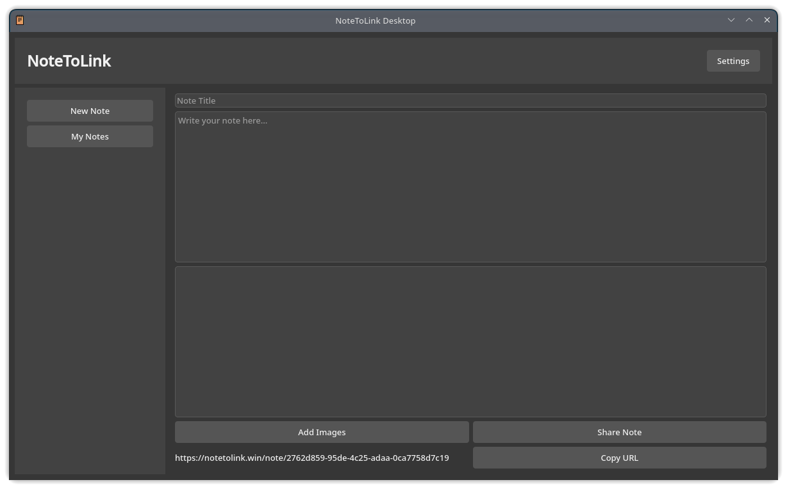

# 🧾 Notetolink App

**Notetolink App** is a cross-platform desktop application built with **PyQt5**, allowing users to create and instantly share notes containing text and up to 5 images via the [Notetolink API](https://notetolink.win). It supports categories, drag-and-drop organization, and dark/light themes. All data is stored locally in JSON format.



---

## 🚀 Features

- ✍️ Create notes with title, content, and up to 5 images
- 🌐 Generate public links using the Notetolink API
- 🗂️ Organize notes into categories (with drag-and-drop)
- 🌓 Dark/Light theme toggle
- 💾 Local JSON storage for offline use

---

## 📦 Requirements

- Python 3.8 or higher
- PyQt5
- requests

### 📥 Installation
```bash
pip install -r requirements.txt
```

**requirements.txt**:
```
PyQt5>=5.15
requests
```

---

## ▶️ Running the App

```bash
python app.py
```

---

## 🗃️ Project Structure
```
notetolink-app/
├── app.py                  # Main application entry point
├── screenshot.png          # Application screenshot
├── requirements.txt
├── README.md
```

---

## 🤝 Contributing

Open to feedback and contributions — just keep it clean and useful. Pull requests are welcome. If you find bugs or have feature ideas, feel free to open an issue.

---

## 📫 Contact

- 📧 Email: [toxi360@workmail.com](mailto:toxi360@workmail.com)
- 💻 GitHub: [Efeckc17](https://github.com/Efeckc17)
- 🌍 Website: [toxi360.org](https://toxi360.org)

---

## 📄 License

This project is licensed under the MIT License.

---

